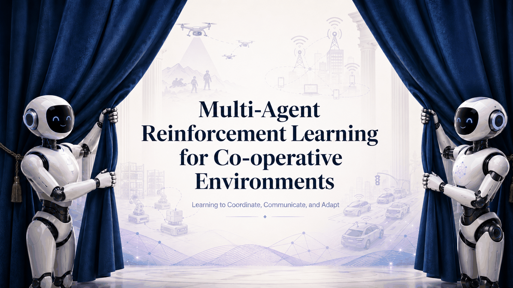

# Multi-Agent Reinforcement Learning for Cooperative Environments

**Learning to Coordinate, Communicate, and Adapt**



An interactive educational resource for learning how multiple
reinforcement-learning agents cooperate toward shared goals.

## Why This Resource?

Many real-world systems involve multiple decision-makers. Agents may need to:

- **Coordinate** their actions.
- **Communicate** useful information.
- **Adapt** when other agents or conditions change.

This resource develops these ideas from first principles and connects them to
modern cooperative MARL research.

## Who Is This Designed For?

- **Researchers** entering cooperative MARL, or wanting a grounded refresher on
  coordination, communication, and partner generalization.
- **Lecturers teaching a MARL course**, who need chapters, worksheets, labs, and
  knowledge checks that can be used directly or adapted.
- **Anyone curious about multi-agent reinforcement learning**, with a basic
  foundation in Python and single-agent RL.

Suitable for **undergraduate and graduate levels**. Every practical activity
runs on a laptop or a free Colab CPU session.

## Learning Journey

**Background → Coordinate → Communicate → Adapt → Challenge Lab → Final Project**

- **Chapter 1: Coordinate:** How can agents learn actions that work well
  together?
- **Chapter 2: Communicate:** What information should agents share when they
  know different things?
- **Chapter 3: Adapt:** Can agents still cooperate when the other agents change?

## Educational Resources

- **Interactive Tutorial:** A structured, markdown-first tutorial that develops
  cooperative MARL from the foundations through coordination, communication, and
  adaptation. Concepts are introduced intuitively before moving to formal
  definitions, equations, and research connections.

- **Virtual Lab:** A browser-based lab where learners experiment with joint
  actions, independent learning, and value decomposition, and observe how
  different training approaches affect coordinated behaviour.

- **Google Colab Labs:** Guided practical labs where learners complete small
  pieces of code, run experiments, visualize learned behaviour, and interpret
  the results:
  - **Learning a Communication Protocol:** Train speaker-listener agents,
    inspect the learned protocol, and test communication capacity, noise, and
    protocol mismatch.
  - **Cooperating with Unseen Partners:** Compare familiar-partner and
    cross-play performance, train with diverse partners, build a simple partner
    model, and observe adaptation when partner behaviour changes.

- **Embedded Knowledge Checks:** Short questions throughout the tutorial that
  ask learners to predict outcomes, test conceptual understanding, and receive
  immediate feedback.

- **Digital Worksheets:** Concise chapter activities that combine concept
  matching, calculations, interactive exploration, and short design trade-offs.

- **Challenge Lab: Wireless Network Resource Allocation using MARL:** A
  hands-on integration challenge where learners combine coordination,
  communication, and adaptation to manage channel allocation, interference,
  changing traffic conditions, and unfamiliar access-point behaviour.

- **Final Project: Design a MARL-Based Disaster-Response System:** A
  create-level project where learners design a complete cooperative MARL system,
  including its agents, observations, actions, shared objective, coordination
  strategy, communication design, adaptation mechanism, and evaluation plan.

- **`cooperative-marl-labs` Python Package:** A lightweight package containing
  the environments, agents, partner policies, training utilities, evaluation
  tools, and visualizations used in the Colab labs.

Planned, and not yet part of the resource: short **visual explainers**, under
five minutes each, introducing cooperative MARL, coordination, communication,
and adaptation.

## Learning Objectives

By the end of the resource, learners should be able to:

- formulate cooperative MARL problems;
- explain coordination, communication, and adaptation challenges;
- compare approaches for learning cooperative behaviour;
- analyse multi-agent behaviour through experiments;
- evaluate cooperation under unfamiliar conditions;
- design and justify a cooperative MARL system.

The learning activities progress through Bloom's Taxonomy:

**Remember → Understand → Apply → Analyse → Evaluate → Create**

## Quick Start

### Run the Tutorial

```bash
git clone https://github.com/rexsimiloluwah/marl-for-cooperative-environments
cd marl-for-cooperative-environments
npm install
npm run dev
```

Then open <http://localhost:4321>.

### Install the Lab Package

```bash
pip install cooperative-marl-labs
```

Example:

```python
from cooperative_marl_labs.envs import WirelessResourceAllocationEnv

env = WirelessResourceAllocationEnv(
    n_agents=4,
    n_channels=3,
)

observations, infos = env.reset(seed=42)
env.render()
```

The practical labs are designed to run without a GPU.

## Educational Integrity

The resource distinguishes three kinds of claim throughout, and never blurs
them:

1. published results, cited;
2. our own measured experimental results;
3. illustrative educational examples.

No synthetic number is presented as a benchmark result, no hand-coded policy is
described as learned, and no rule-based message protocol is described as
emergent. Where a quantity has not been measured, no number is given.

Every measured figure in the Challenge Lab comes from one script,
`scripts/marl/measure_wireless.py`, averaged over three training seeds. The
environments are teaching models rather than benchmarks, and the resource says
so wherever a number appears.

## Contributing

Reviews, corrections, feedback, and contributions that improve the technical
accuracy, accessibility, or educational quality of the resource are welcome.

See [CONTRIBUTING.md](CONTRIBUTING.md) for contribution guidelines, the
repository layout, and how to build and verify each part.

## Citation

If you use this resource in teaching or research, please cite:

```bibtex
@misc{okunowo2026cooperativemarl,
  title  = {Multi-Agent Reinforcement Learning for Cooperative Environments:
            Learning to Coordinate, Communicate, and Adapt},
  author = {Okunowo, Similoluwa},
  year   = {2026},
  url    = {https://github.com/rexsimiloluwah/marl-for-cooperative-environments}
}
```

## License

See [LICENSE](LICENSE).
